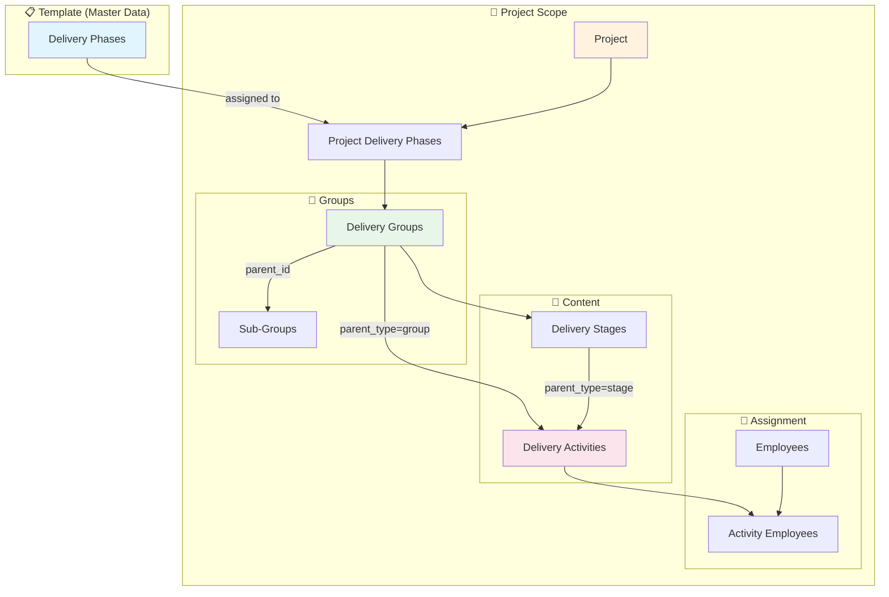
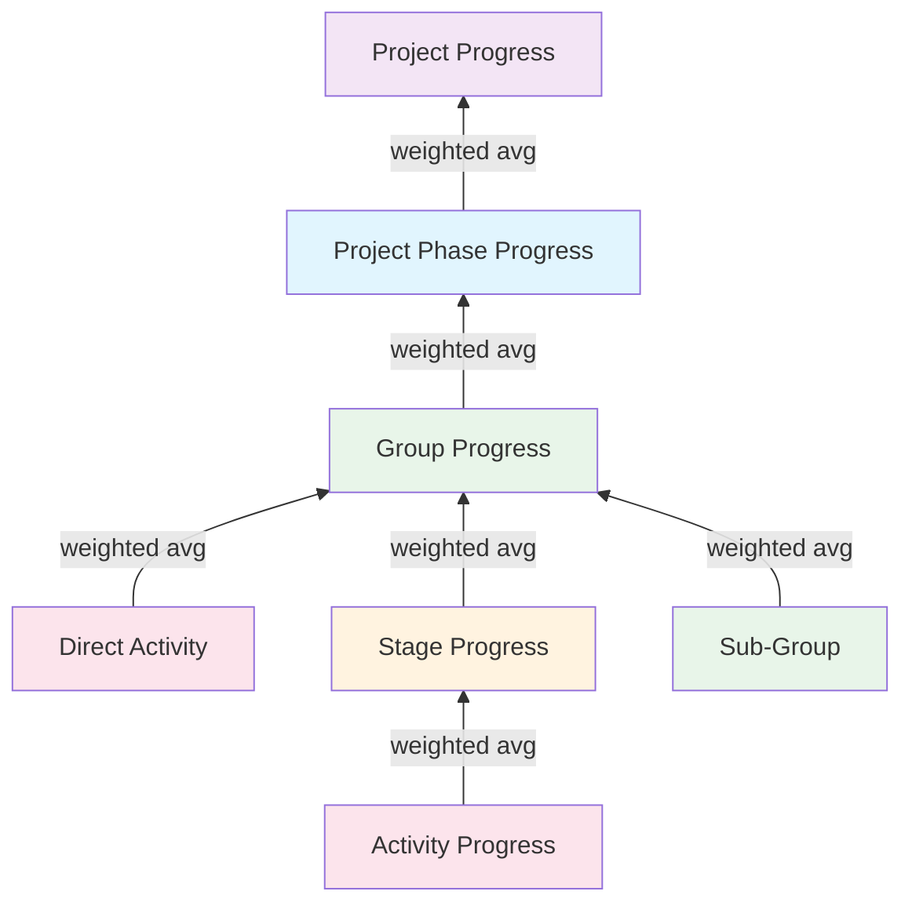

# Delivery Planning - Entity Relationship Diagram

## Mermaid ERD Diagram

Diagram ini dapat di-render di:
- GitHub README
- VSCode dengan extension Mermaid
- https://mermaid.live
- Notion, Confluence, dll

```mermaid
erDiagram
    %% ============================================
    %% CORE TABLES
    %% ============================================

    projects {
        bigint id PK
        varchar name
        varchar code
        text description
        bigint customer_id
        enum status
        date start_date
        date end_date
        timestamp created_at
        timestamp updated_at
    }

    employee {
        bigint employee_id PK
        varchar full_name
        varchar email
        varchar position
        varchar department
        boolean is_active
    }

    %% ============================================
    %% DELIVERY PHASES
    %% ============================================

    delivery_phases {
        bigint id PK
        varchar name
        varchar code
        text description
        varchar color
        varchar icon
        int order_sequence
        enum orientation
        boolean is_system_default
        boolean is_optional
        boolean is_active
        bigint parent_phase_id FK
        json settings
        json metadata
    }

    project_delivery_phases {
        bigint id PK
        bigint project_id FK
        bigint delivery_phase_id FK
        decimal weight
        int order_sequence
        boolean is_visible
        boolean is_golive_phase
        enum orientation
        json custom_settings
        decimal calculated_progress
        date calculated_start_date
        date calculated_end_date
    }

    %% ============================================
    %% DELIVERY GROUPS
    %% ============================================

    delivery_groups {
        bigint id PK
        bigint project_id FK
        bigint phase_id FK
        bigint project_phase_id FK
        bigint parent_id FK "Self-ref untuk sub-group"
        varchar name
        varchar code
        text description
        int level
        int order_sequence
        varchar path "Materialized path"
        date start_date
        date end_date
        date actual_start_date
        date actual_end_date
        decimal weight
        enum status
        decimal progress_percentage
        varchar color
        varchar icon
        text notes
        json settings
        json metadata
    }

    %% ============================================
    %% DELIVERY STAGES (Optional)
    %% ============================================

    delivery_stages {
        bigint id PK
        bigint group_id FK
        bigint project_id FK
        varchar name
        varchar code
        text description
        int order_sequence
        varchar color
        date planned_start_date
        date planned_end_date
        date actual_start_date
        date actual_end_date
        decimal weight
        enum status
        decimal progress
        json custom_fields
        json metadata
    }

    %% ============================================
    %% DELIVERY ACTIVITIES (Flexible Parent)
    %% ============================================

    delivery_activities {
        bigint id PK
        bigint project_id FK
        bigint phase_id FK
        enum parent_type "stage atau group"
        bigint stage_id FK "Jika parent_type=stage"
        bigint group_id FK "Jika parent_type=group"
        varchar name
        varchar code
        text description
        int order_sequence
        varchar module
        varchar tcode
        enum complexity
        varchar receive_type
        boolean new_requirement
        text functional_sinergi
        text technical_sinergi
        text deliverable
        date start_date
        date end_date
        date actual_start_date
        date actual_end_date
        decimal weight
        enum status
        decimal progress_percentage
        text notes
        text acceptance_criteria
        json custom_fields
        json metadata
    }

    %% ============================================
    %% EMPLOYEE ASSIGNMENT
    %% ============================================

    delivery_activity_employees {
        bigint id PK
        bigint activity_id FK
        bigint employee_id FK
        enum role
        decimal allocation_percentage
        date assigned_date
        date start_date
        date end_date
        boolean is_active
        text notes
    }

    %% ============================================
    %% VIEW CONFIGURATIONS
    %% ============================================

    delivery_view_configurations {
        bigint id PK
        bigint project_id FK
        bigint user_id FK
        enum default_view
        json visible_phases
        json collapsed_groups
        json column_settings
        json filters
    }

    %% ============================================
    %% RELATIONSHIPS
    %% ============================================

    projects ||--o{ project_delivery_phases : "has phases"
    projects ||--o{ delivery_groups : "has groups"
    projects ||--o{ delivery_stages : "has stages"
    projects ||--o{ delivery_activities : "has activities"
    projects ||--o{ delivery_view_configurations : "has view configs"

    delivery_phases ||--o{ project_delivery_phases : "used in projects"
    delivery_phases ||--o{ delivery_groups : "template for"
    delivery_phases ||--o{ delivery_activities : "template for"
    delivery_phases ||--o| delivery_phases : "parent (self-ref)"

    project_delivery_phases ||--o{ delivery_groups : "contains"

    delivery_groups ||--o{ delivery_groups : "has sub-groups (self-ref)"
    delivery_groups ||--o{ delivery_stages : "has stages"
    delivery_groups ||--o{ delivery_activities : "has direct activities"

    delivery_stages ||--o{ delivery_activities : "has activities"

    delivery_activities ||--o{ delivery_activity_employees : "assigned to"
    employee ||--o{ delivery_activity_employees : "works on"
```



## Hierarchy Visual

```
PROJECT
│
└── PROJECT_DELIVERY_PHASES (Konfigurasi fase per-project)
    │
    ├── DELIVERY_GROUPS (Level 0 - Root)
    │   │
    │   ├── Sub-Group (Level 1)
    │   │   └── Sub-Sub-Group (Level 2)
    │   │       └── ... (Unlimited nesting)
    │   │
    │   ├── DELIVERY_STAGES (Optional)
    │   │   └── DELIVERY_ACTIVITIES (parent_type='stage')
    │   │       └── Employee Assignments
    │   │
    │   └── DELIVERY_ACTIVITIES (parent_type='group') ← LANGSUNG!
    │       └── Employee Assignments
    │
    └── DELIVERY_GROUPS (Another root group)
        └── ...
```

## Data Flow



## Progress Calculation Flow



## Penggunaan

### 1. dbdiagram.io
1. Buka https://dbdiagram.io
2. Copy isi file `delivery_planning.dbml`
3. Paste di editor
4. Diagram otomatis ter-render

### 2. Mermaid Live Editor
1. Buka https://mermaid.live
2. Copy kode mermaid dari bagian ERD di atas
3. Diagram otomatis ter-render

### 3. VSCode
1. Install extension "Markdown Preview Mermaid Support"
2. Buka file ini
3. Preview dengan Ctrl+Shift+V

### 4. GitHub
- File markdown dengan mermaid akan otomatis di-render di GitHub

## Quick Reference

| Table | Description |
|-------|-------------|
| `delivery_phases` | Template fase (master) |
| `project_delivery_phases` | Konfigurasi fase per-project |
| `delivery_groups` | Grup dengan sub-group support |
| `delivery_stages` | Tahapan dalam grup (optional) |
| `delivery_activities` | Aktivitas dengan flexible parent |
| `delivery_activity_employees` | Assignment karyawan |
| `delivery_view_configurations` | Preferensi tampilan user |

## Key Features

1. **Flexible Hierarchy**: Activity bisa di Stage ATAU langsung di Group
2. **Unlimited Sub-groups**: Self-referencing dengan materialized path
3. **Weighted Progress**: Propagasi progress dari bawah ke atas
4. **Employee Assignment**: Multiple role support per activity
5. **Soft Delete**: Audit trail dengan deleted_at
