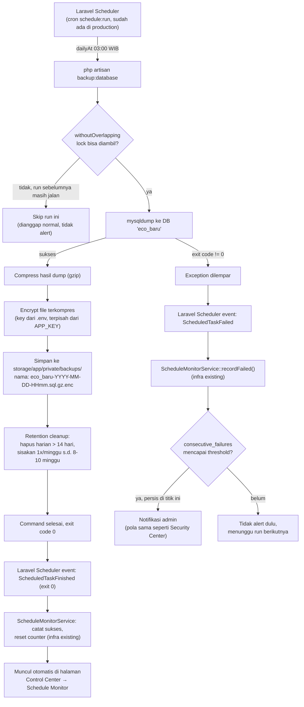

# Rencana Implementasi — Automated Database Backup

> **Status: 📝 RENCANA — belum ada kode yang diubah.**
> Dokumen ini hasil diskusi sebelum implementasi. Tujuannya menyamakan pemahaman soal alur & lingkup dulu, baru lanjut ke kode.

## Latar belakang

Backup database saat ini dilakukan **manual lewat Navicat** oleh satu orang. Risikonya:
- Bergantung pada satu orang ingat menjalankannya tiap hari — tidak ada jaminan konsistensi.
- Tidak ada retensi terstruktur (berapa lama backup lama disimpan, kapan dihapus).
- Kalau lupa/berhalangan beberapa hari, tidak ada yang sadar sampai backup benar-benar dibutuhkan (baru ketahuan saat sudah terlambat).

**Goal:** backup DB `eco_baru` berjalan otomatis tiap hari, terenkripsi, dengan retensi otomatis, dan **termonitor** — kalau gagal atau berhenti jalan, admin dapat notifikasi tanpa perlu ada yang buka Navicat untuk mengecek.

## Keputusan yang sudah disepakati (dari diskusi)

| Aspek | Keputusan |
|---|---|
| Jadwal | Harian, **03:00 WIB** (setelah `activities:recompute-status` 00:05 dan `onedrive:audit-links --fix` 02:30, di luar jam kerja) |
| Storage | **Local disk saja dulu** (offsite/cloud menyusul, lihat [Risiko & Item Terbuka](#risiko--item-terbuka)) |
| Retensi | Harian disimpan **14 hari**, mingguan disimpan **~8–10 minggu**, bulanan belum (nanti gampang ditambah) |
| Enkripsi | **Wajib** — DB berisi data sensitif (kredensial customer, dll) |
| Monitoring | Nempel ke infra **Schedule Monitor** yang sudah ada (bukan bikin sistem alert baru) |

## Alur lengkap (bagaimana fitur ini bekerja)

Penjelasan tiap langkah:

1. **Trigger** — tidak perlu cron baru. Production sudah punya cron eksternal yang memanggil `schedule:run` tiap menit (dipakai 7 task lain yang sudah ada). Command backup baru tinggal didaftarkan di `routes/console.php` dengan `->dailyAt('03:00')`, otomatis ikut ke-pickup.
2. **Lock (`withoutOverlapping`)** — mencegah dua proses backup jalan bersamaan kalau run sebelumnya belum selesai (dump lambat, dsb). Pola ini sudah dipakai task lain (`onedrive:audit-links`, `security:detect-anomalies`).
3. **Dump** — `mysqldump` dijalankan ke koneksi DB default (`eco_baru`), lewat proses shell (`Symfony\Process`, bukan `exec()` mentah, supaya argumen — termasuk password — tidak lewat shell string yang bisa kena injection).
4. **Compress** — hasil `.sql` di-gzip supaya hemat storage.
5. **Encrypt** — file terkompres dienkripsi (AES) pakai key khusus dari `.env` (**bukan** `APP_KEY` — supaya rotasi `APP_KEY` aplikasi tidak bikin backup lama tidak bisa dibuka).
6. **Simpan lokal** — ke `storage/app/private/backups/` (mengikuti root disk `local` yang sudan dikonfigurasi di `config/filesystems.php`), dengan nama file mengandung timestamp.
7. **Retention cleanup** — di akhir command yang sama: hapus backup harian yang lebih tua dari 14 hari, tapi sisakan satu backup per minggu (misal yang jatuh hari Minggu) sampai 8–10 minggu ke belakang sebelum benar-benar dihapus.
8. **Monitoring — tidak bikin sistem baru.** Karena command didaftarkan dengan `->name('backup-database')`, `ScheduleMonitorServiceProvider` yang sudah ada otomatis menangkap event sukses/gagal dari Laravel Scheduler itu sendiri. Kalau gagal 3x berturut-turut → admin dapat notifikasi otomatis (mekanisme yang sama persis dipakai Security Center). Statusnya juga otomatis muncul sebagai baris baru di halaman **Control Center → Schedule Monitor** — tidak perlu bikin UI terpisah.

### Alur restore (manual, untuk drill/DR — terpisah dari alur otomatis di atas)

1. Ambil file `.sql.gz.enc` dari `storage/app/private/backups/` sesuai tanggal yang dibutuhkan.
2. Decrypt pakai key dari `.env` → decompress → dapat file `.sql` mentah.
3. Restore ke **database scratch/terpisah** (bukan langsung ke `eco_baru` production) untuk verifikasi dulu.
4. Cek sanity: jumlah baris tabel-tabel utama, tidak ada error saat import.
5. Dilakukan berkala (usulan: tiap kuartal) supaya backup yang ada benar-benar terbukti bisa dipulihkan, bukan cuma "asumsi filenya ada berarti aman".

## Yang perlu disiapkan (lingkup perubahan, bukan kode dulu)

**Di level image/server:**
- [ ] `Dockerfile` — tambah `default-mysql-client` (atau `mariadb-client`, sesuaikan versi MySQL server) ke `apt-get install`. Saat ini belum ada, jadi `mysqldump` tidak tersedia di container.
- [ ] **Konfirmasi ke pemegang server/orchestrator**: apakah `storage/app` (atau folder backup) persist di luar siklus hidup container, atau hilang tiap `rebuild + restart`? Ini blocker sebelum "local saja" bisa diandalkan di production — lihat [Risiko](#risiko--item-terbuka).
- [ ] Cek ruang disk kosong di server production relatif terhadap ukuran DB aktual × jumlah backup yang akan disimpan (14 harian + ~8-10 mingguan).
- [ ] Tambah secret baru di `.env` production: key/password enkripsi backup.

**Di level kode (nanti, belum sekarang):**
- [ ] Command baru `app/Console/Commands/BackupDatabase.php` (`backup:database`) — custom command, bukan package (`spatie/laravel-backup`), supaya konsisten dengan pola command monitoring lain yang sudah ada (`CheckScheduleStaleness`, `CheckQueueHealth`) dan supaya logic retensi/enkripsi bisa dikontrol persis sesuai kebutuhan tanpa fitur package yang tidak dipakai.
- [ ] Daftarkan di `routes/console.php`: `Schedule::command('backup:database')->dailyAt('03:00')->name('backup-database')->withoutOverlapping()`.
- [ ] Tambah entry `backup-database` di `config/schedule_monitor.php` (label, `stale_after_minutes` — perlu sedikit lebih longgar dari 24 jam untuk kasih toleransi, misal 1500 menit).
- [ ] Logic retensi (hapus file lama sesuai aturan) sebagai bagian akhir command yang sama.

## Risiko & item terbuka

1. **Persistent volume belum dikonfirmasi (blocker).** Kalau `storage/app` tidak persist lintas deploy, backup lokal akan hilang tiap kali ada deploy baru — fitur ini akan kelihatan jalan saat ditest tapi percuma dalam praktik. **Harus dijawab sebelum lanjut ke kode.**
2. **Local-only = tetap ada single point of failure.** Kalau disk/server production bermasalah (hardware fail, ransomware, human error hapus folder), backup ikut hilang bareng data asli. Ini keputusan sadar untuk mulai simpel dulu — offsite (S3-compatible atau OneDrive drive terpisah yang admin-only) bisa ditambah belakangan tanpa redesain besar, tinggal tambah satu langkah upload di akhir command.
3. **Ukuran DB akan terus tumbuh** — retensi & kebutuhan disk perlu ditinjau ulang secara berkala, bukan aturan yang di-set sekali lalu dilupakan.
4. **Belum ada monitoring untuk kapasitas disk backup itu sendiri** — kalau folder backup penuh, retention cleanup seharusnya menjaga ini otomatis, tapi belum ada alert eksplisit kalau disk server secara umum menipis. Bisa jadi follow-up (mirip pola Queue Health yang sudah ada).

## Acceptance criteria (untuk nanti, saat implementasi selesai)

1. Backup berjalan otomatis tiap hari jam 03:00 WIB tanpa intervensi manual.
2. File backup terenkripsi, tidak bisa dibuka tanpa key dari `.env`.
3. Backup harian > 14 hari otomatis terhapus; backup mingguan tetap ada sampai ~8-10 minggu.
4. Backup baru **bertahan setelah deploy/redeploy** (membuktikan poin persistent volume di atas benar-benar aman).
5. Kalau command gagal 3x berturut-turut, admin dapat notifikasi (lewat mekanisme Schedule Monitor yang sudah ada), tanpa perlu buka Navicat/server manual untuk tahu ada masalah.
6. Status backup (kapan terakhir sukses, sedang stale atau tidak) terlihat di Control Center → Schedule Monitor tanpa perlu halaman baru.
7. Restore drill manual dari file backup terbukti berhasil ke database scratch.
